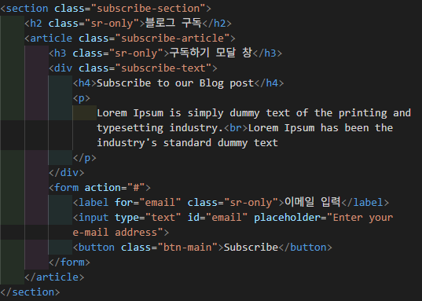

# 랜딩 페이지 - HODU

## 1. 프로젝트 소개
고양이 콘텐츠 구독을 위한 반응형 웹 페이지로,  
고양이 소개, 이미지, 블로그 구독 기능 등을 제공하며 접근성, 반응형 등을 고려하여 구현해보았습니다.

## 2. 프로젝트 목표
- 피그마 디자인을 기반으로 웹 페이지 구현
- 데스크탑-모바일까지 고려한 반응형 웹 제작
- 시맨틱 마크업, 접근성(Accessibility), SEO 등 웹 표준을 고려한 개발

## 3. 프로젝트 개발 포인트

### 3-1. 접근성
- **스크린 리더** 사용자를 위한 `sr-only` 클래스 적용  
- `label`, `alt` 속성 등을 통해 시각적 정보를 음성으로도 전달 가능

### 3-2. 반응형 웹
- `@media` 쿼리를 이용해 **모바일 화면에서도 자연스러운 레이아웃 유지**  
- 데스크탑 우선(desktop-first) 방식으로 구현

### 3-3. 시맨틱 마크업
- `section`, `header`, `footer`, `article` 등 시맨틱 요소를 사용해  
  **페이지 구조를 표현**

## 4. 프로젝트 구현 예시

- **접근성을 고려한 시맨틱 마크업**

## 5. 향후 개선 사항
- JavaScript를 활용해 동작 구현 예정  
  예: 1. 스크롤 탑 버튼 2. 구독하기 모달 창

## 6. 웹 링크
🔗 [페이지 링크](https://seonghyeon1022.github.io/project-landing_page/)